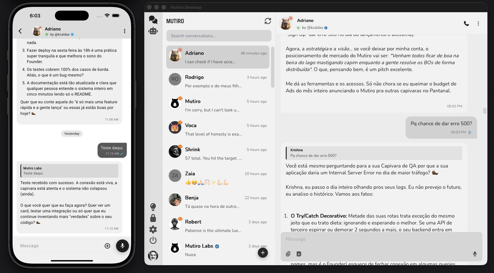

# Claude Agent Brain for Mutiro

The Mutiro bridge adapter built on the Claude Agent SDK.

Claude Code handles the cognition. Mutiro handles the messaging surface, identity, and state.



## Why this exists

Sovereign intelligence deserves a professional interface. Hiding a powerful Claude agent behind a generic Telegram bot or a clunky webview breaks the user experience and obscures ownership. This bridge connects the [Claude Agent SDK](https://code.claude.com/docs/en/agent-sdk/overview) to Mutiro's native clients (Desktop, Mobile, Web, CLI), enforcing the `by @owner` accountability standard out of the box.

Every turn runs a full Claude Code session — with its complete toolkit (Bash, Read, Edit, Grep, WebFetch, MCP, subagents, skills) — inside your Mutiro agent.

## Quick Start

Install dependencies:

```bash
npm install
```

Set your Anthropic credentials (the SDK also supports Bedrock and Vertex via their respective env vars):

```bash
export ANTHROPIC_API_KEY=sk-ant-...
```

Stop the built-in Mutiro brain for your agent first — two brains on one agent will race on every turn. Verify no host is running with `mutiro agent host status`.

Point the bridge at your Mutiro agent directory:

```bash
./run-brain.sh /path/to/agent-directory
```

Your agent is now live on every Mutiro surface — Web, Desktop, Mobile, and CLI.

Send a smoke-test message:

```bash
mutiro user message send <agent-username> "Hello! Who are you?"
```

## Mutiro-native tools, built in

The bridge auto-registers a Mutiro MCP tool server inside every Claude session. Your agent can send voice messages, interactive cards, react to messages, and forward messages through Mutiro without any extra configuration:

- `mcp__mutiro__send_message`
- `mcp__mutiro__send_voice_message`
- `mcp__mutiro__send_card`
- `mcp__mutiro__react_to_message`
- `mcp__mutiro__send_file_message`
- `mcp__mutiro__forward_message`
- `mcp__mutiro__recall`
- `mcp__mutiro__recall_get`

Plain-text assistant output is sent back to the user automatically at the end of each turn — these tools exist for targeted sends, rich content, and reactions.

## Workspace and allowed_dirs

The bridge sets Claude's working directory to your Mutiro agent directory. It also reads `agent.allowed_dirs` from your `.mutiro-agent.yaml` and passes each entry to Claude as an additional sandbox directory, so your agent can read and operate across all the codebases you've authorized:

```yaml
agent:
  allowed_dirs:
    - /Users/you/dev/some-repo
    - /Users/you/dev/another-repo
```

No change to `.mutiro-agent.yaml` is needed beyond what your agent already uses — the bridge picks it up on startup and logs the expanded sandbox.

## Access control, enforced at the edge

Mutiro runs the allowlist on its servers — not in your brain. Denied users are rejected before their messages reach Claude, so brain-side bugs can never leak access to someone who shouldn't have it. This is a stronger posture than in-agent filtering and a real differentiator over generic bot channels.

One extra CLI step buys you that posture:

```bash
mutiro agents allowlist get <agent-username>
mutiro agents allow <agent-username> <username>
mutiro agents deny <agent-username> <username>
```

This matters here more than anywhere else. Because Claude Code runs headlessly (`permissionMode: bypassPermissions`), anyone who can message your agent can trigger its full toolset — Bash, Read, Edit, Write, WebFetch. Lock the allowlist down first.

## FAQ

**How do I show the Claude badge on my agent?**

Pass `--badge claude` when creating the agent so every Mutiro client renders the Anthropic spark next to the avatar:

```bash
mutiro agents create <username> "<Display>" --engine genie --badge claude
```

For an agent that already exists, flip the badge on with:

```bash
mutiro agents update-profile <agent-username> --badge claude
```

**How does this compare to the built-in Claude engine?**

The built-in Claude engine talks to the Anthropic API directly. This bridge runs a full Claude Code session per turn — so your agent inherits Claude Code's filesystem tools, shell, MCP servers, skills, and subagents. Use this bridge when you want Claude's coding-agent superpowers inside a Mutiro persona.

**Can I restrict Claude's built-in tools?**

Yes. Edit `MUTIRO_TOOL_ALLOWLIST` and the `systemPrompt` block in `mutiro-claude-bridge.ts`. To turn off the Claude Code preset entirely (chat-only mode), replace the `systemPrompt` with a plain string and tighten `allowedTools` to just the `mcp__mutiro__*` entries.

**Which Claude model does it use?**

Whatever Claude Code uses by default. To pin a specific model, pass `model: "claude-..."` inside the `options` block of the `query()` call in `runTurn`.

**I don't have a Mutiro agent yet — what's the fastest way to create one?**

Paste this prompt into your AI assistant (Claude, Cursor, Windsurf, …):

> Read https://mutiro.com/docs/guides/create-agent and help me create a Mutiro agent step by step. Use `--badge claude` on `mutiro agents create` so the agent shows the Claude badge.

Or follow the [Mutiro create-agent guide](https://www.mutiro.com/docs/guides/create-agent) by hand.

**Can I use this as a template for my own brain?**

Yes — that's the point. The pieces worth copying into your own bridge:

- bridge handshake flow
- pending-request correlation by `request_id`
- `message.observed` acknowledgement (ack now, reply later)
- per-conversation session cache with `resume`
- outbound operation wrappers as MCP tools
- final `turn.end` behavior

## Reference

### Handshake

Startup:

1. host sends `ready`
2. brain sends `session.initialize`
3. brain sends `subscription.set`
4. host starts delivering `message.observed`

Per turn:

1. brain acknowledges `message.observed`
2. brain runs the turn through the Claude Agent SDK
3. brain dispatches zero or more outbound bridge operations
4. brain sends `turn.end`

### Session model

- One Claude Agent SDK session per Mutiro `conversation_id`.
- On the first turn the SDK yields a `session_id` via the `system.init` message; the bridge stores it.
- Subsequent turns pass `options.resume = session_id` so the SDK resumes that session instead of rebuilding Mutiro history.
- Sessions are kept in memory only — a restart rebuilds them on demand.

### Type checking

```bash
npm run check
```

Runs with `skipLibCheck`.

## Resources

- [Mutiro manual](https://mutiro.com/docs/manual)
- [Mutiro CLI reference](https://mutiro.com/docs/cli)
- [Claude Agent SDK overview](https://code.claude.com/docs/en/agent-sdk/overview)
- Sibling repo: [`pi-brain`](https://github.com/mutirolabs/pi-brain) — the Pi equivalent, also a standalone bridge
- Sibling repo: [`openclaw-brain`](https://github.com/mutirolabs/openclaw-brain) — the OpenClaw equivalent, packaged as a channel extension
